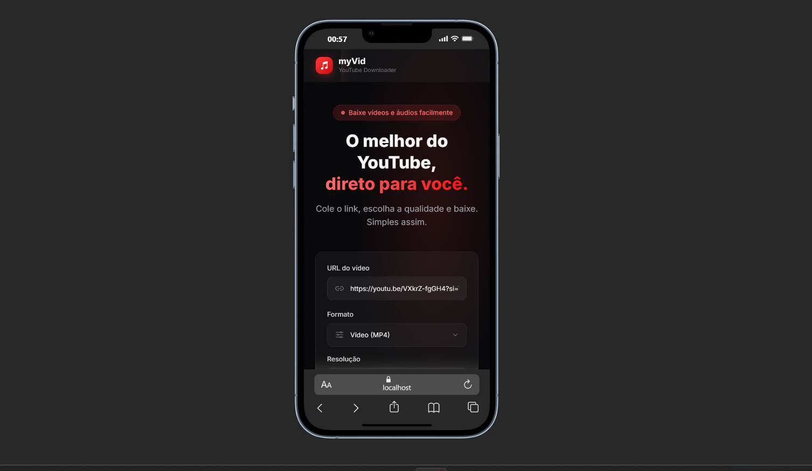
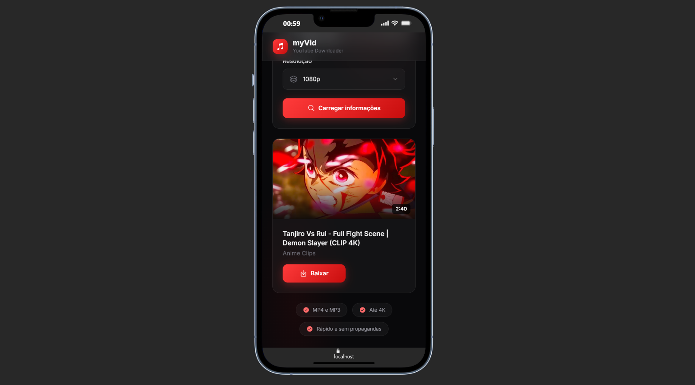

# 🎬 myVid — YouTube Downloader

O myVid é uma ferramenta moderna e poderosa para baixar vídeos e áudios do YouTube. Construído com foco em performance e uma experiência de usuário premium, o projeto utiliza o `yt-dlp` no backend e oferece uma interface limpa, rápida e sem anúncios.




---

## 📌 Índice
- [🚀 Sobre o Projeto](#-sobre-o-projeto)
- [🛠️ Tecnologias](#️-tecnologias)
- [📡 Documentação da API](#-documentação-da-api)
- [💻 Como Rodar](#-como-rodar)
- [✨ Possíveis Melhorias](#-possíveis-melhorias)
- [🤝 Contribuição](#-contribuição)

---

## 🚀 Sobre o Projeto
O myVid foi desenhado para ser "plug-and-play". Ele gerencia automaticamente as dependências do `yt-dlp`, verificando o ambiente do servidor (Windows ou Linux) e baixando a versão correta se necessário. Além disso, ele funciona como uma **API aberta**, permitindo que outros serviços consumam seu motor de download.

---

## 🛠️ Tecnologias


- **Backend**: Node.js & Express.js
- **Motor**: yt-dlp (com `yt-dlp-wrap`)
- **Frontend**: Vanilla JavaScript & Tailwind CSS (Dark Mode & Glassmorphism)
- **Ícones**: IonIcons
- **Segurança**: Express Rate Limit & CORS

---

## 📡 Documentação da API

O myVid aceita requisições `GET` e `POST` (JSON) para facilitar a integração com terceiros.

### 1. Obter Informações do Vídeo
Retorna metadados como título, thumbnail, duração e formatos disponíveis.

- **Endpoint**: `/api/info`
- **Método**: `GET` ou `POST`
- **Parâmetros**: `url` (Link do YouTube)

**Exemplo POST JSON:**
```json
{
  "url": "https://www.youtube.com/watch?v=XYZ"
}
```

### 2. Download Direto
Inicia o stream de download do arquivo.

- **Endpoint**: `/api/download`
- **Método**: `GET`
- **Parâmetros**:
  - `url`: Link do vídeo.
  - `format`: `video` ou `audio`.
  - `quality`: Resolução (ex: `1080`, `720`, `480`).

---

## 💻 Como Rodar

### Pré-requisitos
- [Node.js](https://nodejs.org/) instalado.
- [Python](https://www.python.org/) (necessário para o yt-dlp funcionar).

### Instalação
1. Clone o repositório:
   ```bash
   git clone https://github.com/Imacod3r/myVid.git
   ```
2. Instale as dependências:
   ```bash
   npm install
   ```

### Execução
- **Modo Desenvolvimento (com watch mode)**:
  ```bash
  npm run dev
  ```
- **Modo Produção**:
  ```bash
  npm start
  ```
O servidor estará rodando em `http://localhost:3000`.

---

## ✨ Possíveis Melhorias
- [ ] **Sistema de Cache**: Evitar buscar informações do mesmo vídeo repetidamente em um curto espaço de tempo.
- [ ] **Suporte a Playlists**: Adicionar lógica para iterar e baixar múltiplos vídeos de uma vez.
- [ ] **Progress Bar em Tempo Real**: Usar WebSockets para enviar o progresso real do download para o frontend.
- [ ] **Dashboard Admin**: Uma área para monitorar o uso da API e logs do servidor.

---

## 🤝 Contribuição
Contribuições são o que fazem a comunidade open source um lugar incrível para aprender, inspirar e criar. Qualquer contribuição que você fizer será **muito apreciada**.

1. Faça um Fork do projeto
2. Crie uma Branch para sua Feature (`git checkout -b feature/AmazingFeature`)
3. Adicione suas mudanças (`git commit -m 'Add some AmazingFeature'`)
4. Push para a Branch (`git push origin feature/AmazingFeature`)
5. Abra um Pull Request

---
Feito com ❤️ por [ImaCod3r](https://github.com/Imacod3r)
